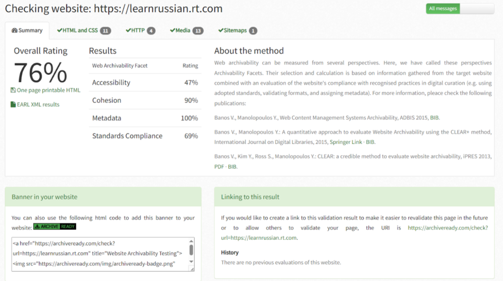
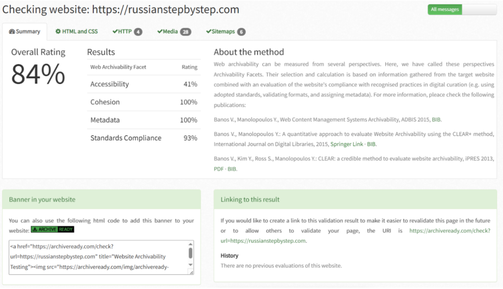

# Коллекция веб-архивов сайтов для изучения русского языка как иностранного

Этот репозиторий содержит коллекцию веб-архивов (WARC) образовательных сайтов, посвящённых изучению русского языка. Архивы собраны с помощью инструментов веб-захвата и проанализированы для изучения структуры, доступности и состава контента.

## Автор проекта
**Поля Дорожкина**

## Лицензия
**CC0 1.0 Universal (Public Domain)**  
Материалы можно использовать, копировать и перерабатывать без ограничений.

---

# Оглавление
1. [Метод и технология сбора архивов](#метод-и-технология-сбора-архивов)  
2. [Описание сайтов](#описание-сайтов)  
3. [WARC-архивы](#warc-архивы)  
4. [ArchiveReady — показатели архивируемости](#archiveready--показатели-архивируемости)  
5. [MIME-тип анализ](#mime-тип-анализ)  
6. [Папка Markdown-файлов и дополнительные данные](#папка-markdown-файлов-и-дополнительные-данные)  
7. [Как воспроизвести сбор](#как-воспроизвести-сбор)  
8. [Сводная таблица по сайтам](#сводная-таблица-по-сайтам)  
9. [Выводы](#выводы)

---

# Метод и технология сбора архивов

Для каждого сайта были выполнены следующие шаги:

1. Подготовка рабочей директории.  
2. Запуск инструмента веб-захвата для формирования WARC-файла.  
3. Генерация индекса CDX.  
4. Извлечение текста и технических метаданных в JSONL.  
5. Анализ содержимого через `metawarc`.  
6. Проверка архивируемости сайтов с помощью ArchiveReady.

---

# Описание сайтов

## learnrussian.rt.com  
Онлайн-курс для начинающих от Russia Today, включающий уроки, упражнения, диалоги и видеоматериалы.

## russianforfree.com  
Образовательная платформа с уроками от базового до продвинутого уровня, текстами с аудио и грамматическими материалами.

## russianstepbystep.com  
Материал «Русский шаг за шагом»: упражнения, диалоги, изображения, аудио.

---

# WARC-архивы

Все собранные WARC-файлы доступны по ссылке:

**Google Drive:**  
https://drive.google.com/drive/folders/11iYaL5_yL3B7DSRAJ3iOvaIJ_n9usd2S?usp=sharing

---

# ArchiveReady 

## learnrussian.rt.com

- **Overall:** 76%  
- **Accessibility:** 47%  
- **Cohesion:** 90%  
- **Metadata:** 100%  
- **Standards Compliance:** 69%

## russianforfree.com

- **Overall:** 72%  
- **Accessibility:** 47%  
- **Cohesion:** 69%  
- **Metadata:** 100%  
- **Standards Compliance:** 72%

## russianstepbystep.com

- **Overall:** 84%  
- **Accessibility:** 41%  
- **Cohesion:** 100%  
- **Metadata:** 100%  
- **Standards Compliance:** 93%

---

# MIME-тип анализ

## learnrussian.rt.com

| MIME | Файлов | Доля |
|---|---:|---:|
| application/pdf | 1291 | 58.25% |
| image/png | 1445 | 27.50% |
| image/jpeg | 86 | 6.80% |
| text/html | 472 | 6.47% |
| image/gif | 85 | 0.47% |
| application/javascript | 3 | 0.28% |
| text/css | 9 | 0.13% |
| application/octet-stream | 6 | 0.08% |
| application/json | 1 | 0.0004% |
| **Итого:** | **2198** | **100%** |

---

## russianforfree.com

| MIME | Файлов | Доля |
|---|---:|---:|
| audio/mpeg | 1045 | 66.81% |
| text/html | 666 | 25.08% |
| image/jpeg | 128 | 2.80% |
| image/png | 293 | 2.05% |
| application/pdf | 19 | 1.70% |
| image/gif | 104 | 1.00% |
| application/javascript | 11 | 0.23% |
| application/x-shockwave-flash | 6 | 0.16% |
| text/xml | 2 | 0.12% |
| text/css | 8 | 0.03% |
| text/plain | 1 | 0.0003% |
| **Итого:** | **2667** | **100%** |

---

## russianstepbystep.com

| MIME | Файлов | Доля |
|---|---:|---:|
| text/html | 6212 | 43.27% |
| image/jpeg | 1832 | 22.07% |
| audio/mpeg | 68 | 11.06% |
| application/javascript | 476 | 10.78% |
| image/png | 465 | 7.82% |
| text/css | 186 | 1.47% |
| application/json | 1472 | 1.22% |
| image/svg+xml | 19 | 0.59% |
| text/xml | 372 | 0.45% |
| application/vnd.ms-fontobject | 11 | 0.26% |
| font/ttf | 9 | 0.20% |
| application/msword | 2 | 0.20% |
| x-font/woff | 8 | 0.14% |
| application/rss+xml | 82 | 0.13% |
| application/pdf | 2 | 0.09% |
| font/woff2 | 4 | 0.05% |
| image/gif | 46 | 0.04% |
| text/plain | 12 | 0.03% |
| **Итого:** | **11280** | **100%** |

---

# Папка Markdown-файлов и дополнительные данные

В корне репозитория находятся дополнительные файлы:

- **md_files/** — извлечённый текстовый контент страниц каждого сайта;  
- **export.jsonl** — текстовое содержимое страниц и служебные поля;  
- **metadata.jsonl** — технические метаданные элементов архива: MIME-типы, размеры, структура ресурсов.

---

# Сводная таблица по сайтам

| Сайт | Контент | Всего файлов | Особенности |
|---|---|---:|---|
| **learnrussian.rt.com** | Уроки, упражнения, диалоги | 2198 | много PDF и изображений |
| **russianforfree.com** | Уроки, грамматика, аудио | 2667 | преобладает аудиоконтент |
| **russianstepbystep.com** | Обучение «шаг за шагом» | 11280 | крупнейший, много HTML и графики |

---

# Выводы

- Все сайты успешно архивированы и доступны для анализа.  
- Различия между сайтами отражают их образовательную модель: где-то больше аудио, где-то графики или текстов.  
- Коллекция пригодна для цифровых гуманитарных исследований, корпусной лингвистики и анализа учебных материалов.  

